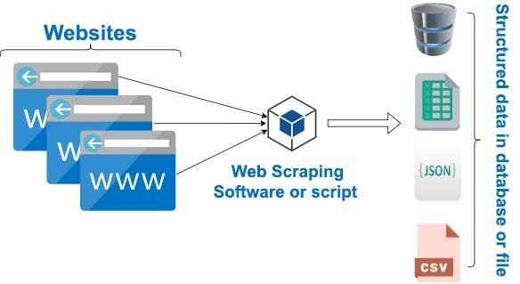

# **Scraping Quotes Using Beautiful Soup**
A clean and simple script for scraping and storing web-scraping data for beginners using the Beautiful Soup library.  

    

## Introduction
The *Beautiful Soup (bs4)* is a Python library for fetching web data out of HTML and XML scripts. It functions with a specific set of parsers to provide idiomatic ways of navigating through the DOM structure, searching, and modifying the parse tree.

## Objective
The primary objective is to illustrate an example of a simple *bs4* script from the site https://quotes.toscrape.com/. In this project, Beautiful Soup and Pandas libraries are utilized to extract the data and store it in memory respectively.

## A simple illustration of the process involved 

    

## Modules and Tools used:
* beautifulsoup4 4.12.2
* pandas 2.0.0
* python 3.11
* PyCharm IDE (2023.1)

## Installation (using pip)
In order to *install* bs4 on the local machine, follow these steps:
1. Open pip and type "pip install beautifulsoup4".
2. To install the Pandas Library, type "pip install pandas".
3. Then, inside the IDE, import the libraries by typing "from bs4 import BeautifulSoup", and on the next line "import pandas" to successfully load the packages to be used for any project.

For more information, check out the following sites:
* https://pypi.org/project/beautifulsoup4/
* https://pypi.org/project/pandas/
